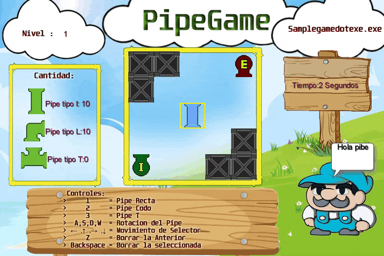

#  Bienvenid@s a Pipegame!!

 ## Equipo de desarrollo 

 - Lucas Antenni 
 - Gaston Abelardo 
 - Facundo Diaz 

 ## Capturas 

  

 ## Reglas de Juego 

El objetivo del juego es conectar todas las Pipes (tuberías) de inicio a las Pipes de fin ,respetando que ninguna Pipe quede sin conectar,Solo basta con seleccionar una de las 3 tipos de Pipes que existen y cambiandole la direccion, podemos colocarlas en el tablero del juego (siempre y cuando no exista algun obstaculo).
Es un juego muy intuitivo y progresivo, el cual contiene varios niveles una vez finalizado o en cualquier momento del juego uno pude salir con la tecla asignada.

 ## Controles
 >     1     = Pipe Recta
 >     2     = Pipe Codo
 >     3     = Pipe T
 >  A,S,D,W  = Rotacion del Pipe
 > Flechas   = Movimiento de Selector
 >     Z     = Borrar la Anterior
 > Backspace = Borrar la seleccionada
 >     P     = Salir del juego

 ## Otros 

 - Materia: Algoritmos 1
 -Universidad: Universidad Nacional de San Martin 
 - Versión de wollok : 18.0.1
 -
