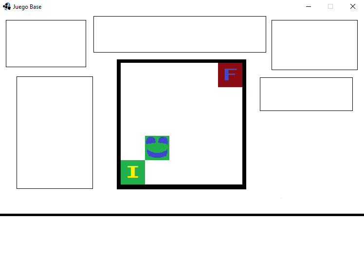

# JuegoDeTuberias_Alpha0.4

## Equipo de desarrollo

- Lucas Antenni
- Gaston Abelardo
- Facundo Diaz

## Capturas

## Reglas de Juego / Instrucciones

(Escribirlas)

## Otros

- Curso/Facultad
- Versión de wollok
- Una vez terminado, no tenemos problemas en que el repositorio sea público / queremos manternerlo privado
